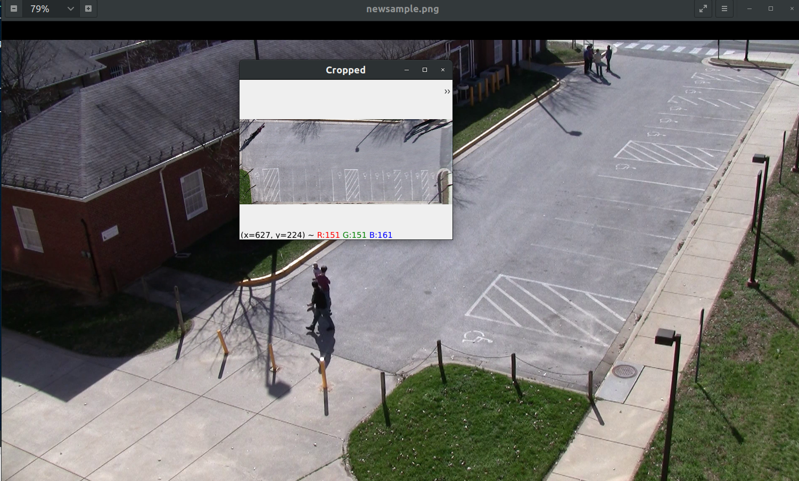

# fourPointCrop
Clicking four points of trapezoid to crop it as a rectangle



## Run

```python3 trapezoid_crop_gui.py```

Click on four corner points of rectangular shape (road ) in image using mouse left click.

Cropped image is saved in crop folder.

