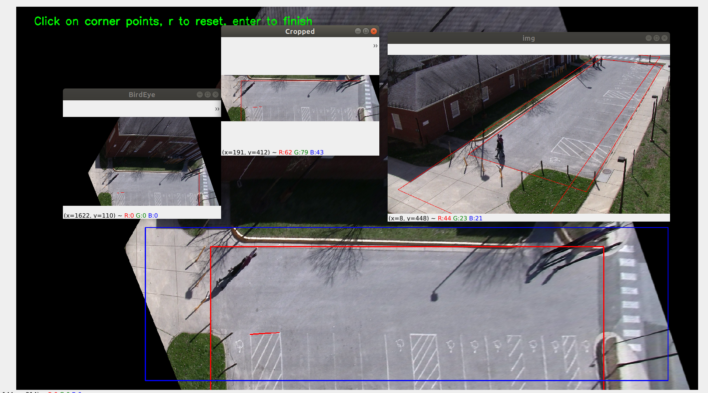

# fourPointCrop
Clicking four points of trapezoid to crop it as a rectangle



## Steps

```python3 new_perspective.py```

Click on four corner points of rectangular shape (road ) in image 

click on any two points to visualize how they gets transformed

click on bounding box region needed in output 

click enter

click enter

click enter

Change if 1: to if 0: to avoid recaliberation.

Enjoy auto cropping of trapezoid and conversion to rectangle for next images fed in.
